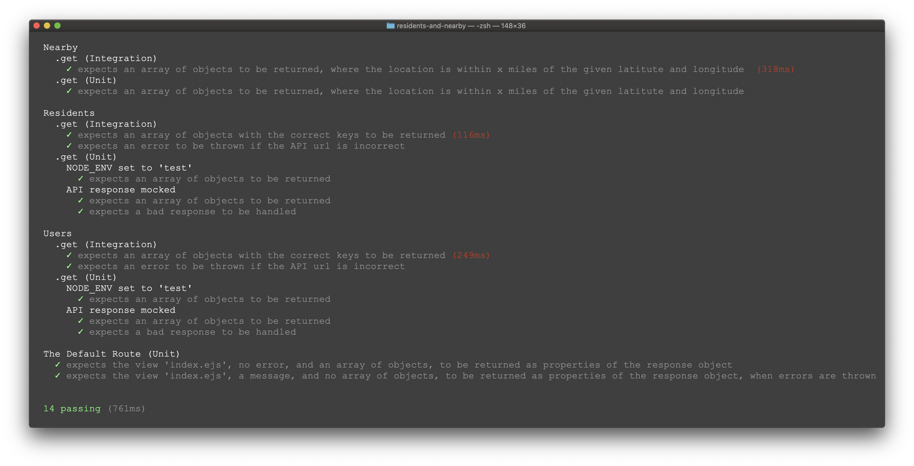
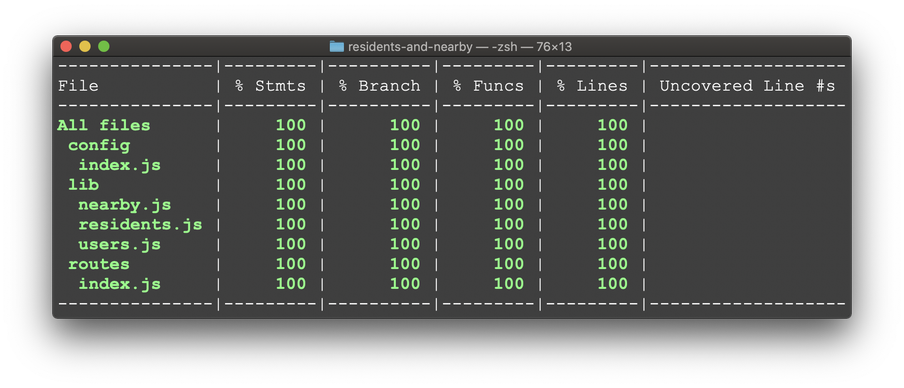
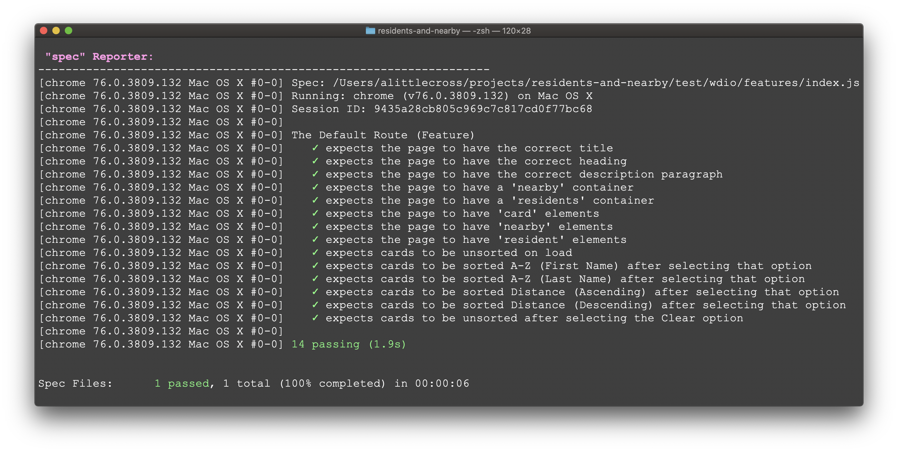

# Residents and Nearby

My solution to the following problem:

> Using Node.js or Vanilla JavaScript, call the API at: https://bpdts-test-app.herokuapp.com/, and return people who are listed as either living in London, or whose current coordinates are within 50 miles of London. Display the results on a webpage.

## Dependencies

Production:

* Node.js
* Express
* EJS
* Isomorphic-Fetch
* Haversine

Development:

* Mocha
* Chai
* Sinon
* Fetch-Mock
* Nyc
* WebdriverIO

## Running the App

### Online

The app is available to use at the following URL: https://residents-and-nearby.herokuapp.com

### Locally

```
$ git clone git@github.com:alittlecross/residents-and-nearby.git

$ cd residents-and-nearby

$ npm install

$ npm start
```

The app will then be available to use at the follwing URL: http://localhost:3000/

The port can be changed by setting the environmental variable `PORT` before running the app.

e.g.
```
$ export PORT=8080
```

## Running Tests

### Integration and Unit Tests

```
$ npm test
```

Test results:



Code coverage:



### Feature Tests

<details>
<summary>Prerequisites</summary>

You must use Node.js version 10.x or above. Visit [Node.js](https://nodejs.org/en/) and choose the version for your system.

You must have the Java Development Kit installed. Visit [Oracle](https://www.oracle.com/technetwork/java/javase/downloads/jdk12-downloads-5295953.html) and choose the version for your system.

**Note:** If prompted by your system to install JDK, do not install the version your system recommends; please follow the link above.

</details>

In one window:

```
$ npm run test-env
```

In another window:

```
$ npm run wdio
```

Test results:

